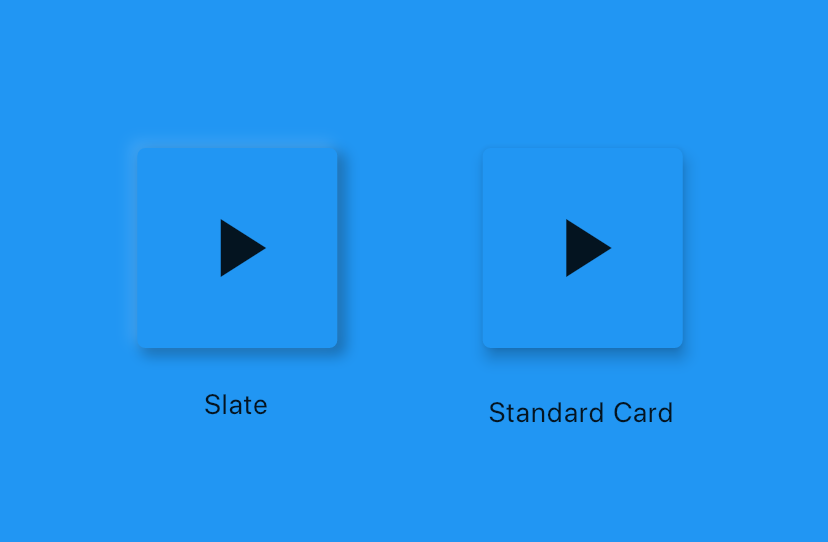

# Slate

A neumorphic library for Flutter. You can read more about the neumorphism trend [here](https://uxdesign.cc/neumorphism-in-user-interfaces-b47cef3bf3a6)

Slate is an alternative to Cards and other floating widgets. Inspired by [neumorphism.io](https://neumorphism.io/)

Slate widgets are designed to look like they stick out of the background as opposed to floating over it. 

Todo:

- [ ] Change direction of shadows
- [ ] Generate colors for shadows instead of using grayscale
- [ ] Change shape of a Slate, ex flat, concave...